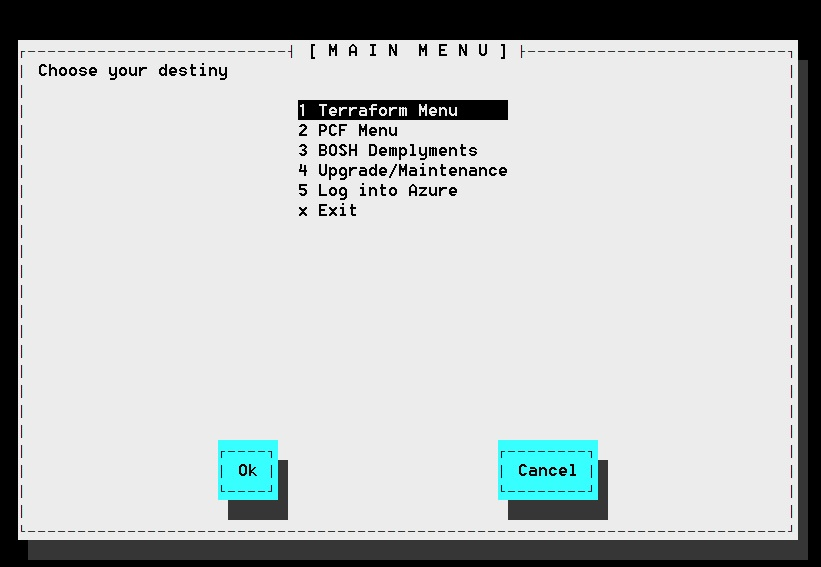
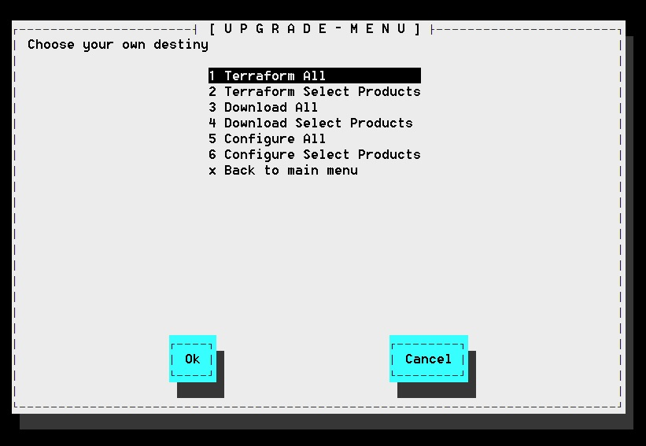
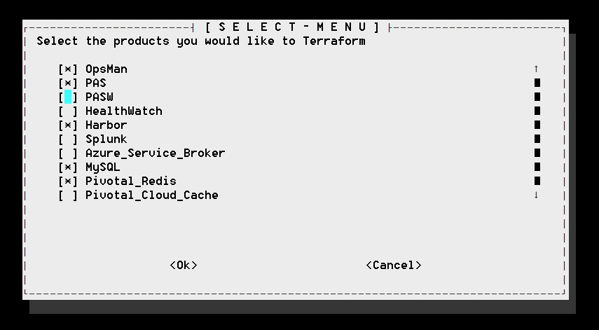
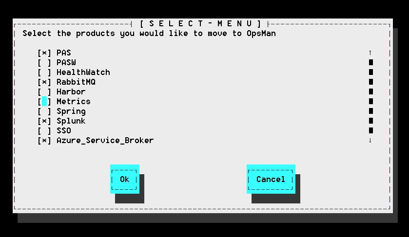
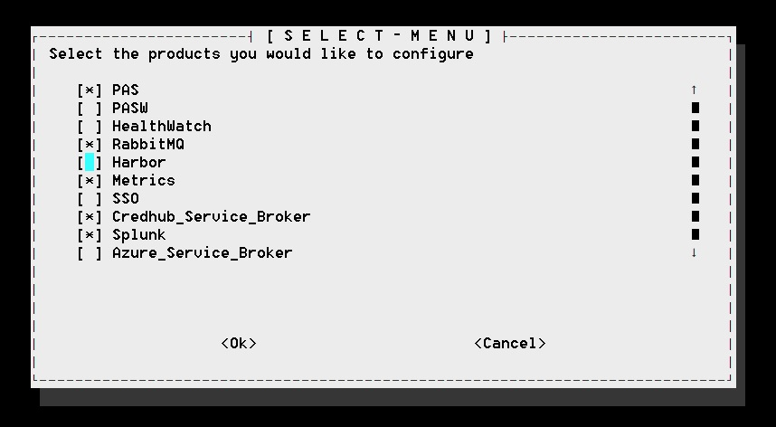
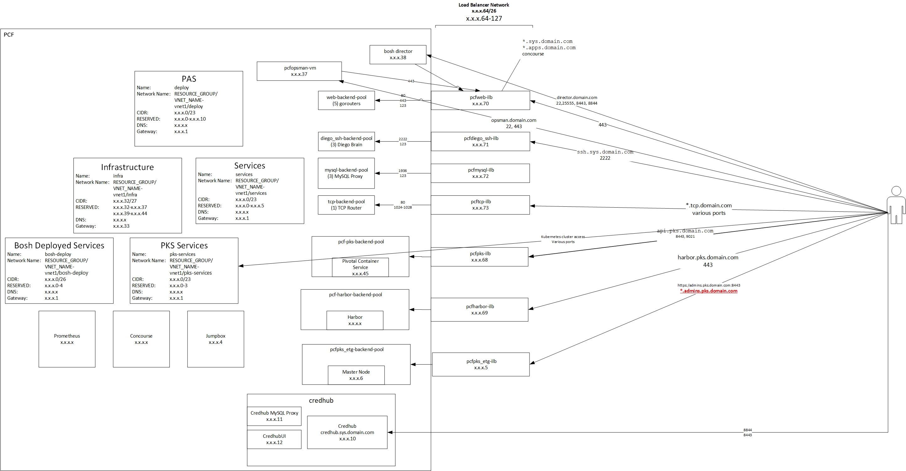

# azure-terraform
Repo for my Azure terraform automation

I have removed all my company information.  I could use some help makeing this easier to consume by all.  The concept is the same.

I am also in the process of transforming from terraform v0.11 to terraform v0.12 syntax.

# Script
## Prerequisites
### CLI's
- uaac
- om
- bosh
- az
- jq
- texplate
- terraform
- whiptail
### Environment Variables
- ARM_ACCESS_KEY  -- 
- ARM_CLIENT_ID
- ARM_CLIENT_SECRET
- TF_VAR_client_id
- TF_VAR_client_secret
- ARM_SUBSCRIPTION_ID
- ARM_TENANT_ID
- TF_VAR_subscription_id
- TF_VAR_tenant_id
- pivnet_token
- 
This script is designed to provide a menu to perform the various actions to provide a fully terraformed and configured Pivtoal Cloud Foundation.

### Menu

#### Foundation to be produced
